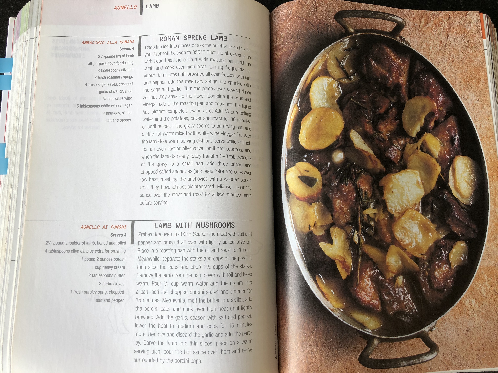

```{r, echo=FALSE, message=FALSE, warning=FALSE}
library(tidyverse)
library(rlang)
library(recipes)
```

## The `recipes` package

Kuhn & Wickham 2017

"Preprocessing Tools to Create Design Matrices"

A recipe is a container for preprocessing steps to go from raw data to an analysis set.

## What to expect?

1) A short introduction of `recipes`

2) The recipe for `recipes`

3) Example in which the recipe for `recipes` is applied

## The `recipes` package

A `recipe` is the specification of an intent, separate the planning from the doing.

```{r, echo = FALSE, out.height="450px", out.width="700px", fig.align='center'}

```

## Creating a `recipe`

```{r, warning = FALSE}
train_set <- mtcars[1:20, c("am", "disp", "hp")]
test_set  <- mtcars[21:32, c("am", "disp", "hp")]
rec <- recipe(train_set, am ~ .)
```

We have defined the roles here, `am` is the outcome, `disp` and `hp` are the predictors.

## Adding `steps` to the `recipe`

```{r}
rec_with_steps <- rec %>% 
  step_center(all_predictors()) %>% 
  step_scale(all_predictors())
```

This is specifying the intent, we didn't do anything on the data yet.

## Preparing the recipe with `prep`

`prep` acquires all the necesarry information on the training set. 

```{r}
(rec_prepped <- rec_with_steps %>% prep())
```

We now have the statistics to apply the centering and scaling derived from the training set and stored in the recipe.

## Preparing the data with `bake`

```{r}
train_final <- bake(rec_prepped, train_set)
test_final  <- bake(rec_prepped, test_set)
```

The statistics to center and scale are learned on the `train_set` and applied to the `test_set`.

```{r}
head(test_final)
```

## Get information with `tidy`

Gives information about the steps in a data frame.

```{r}
tidy(rec_prepped)
```

## Why am I talking about `recipes`?

Added the `check` framework together with Max.

A `check` does not change the data in any way, it tests assumptions and will break `bake` if these are not met.

```{r, error=TRUE}
rec2 <- recipe(train_set) %>% check_missing(everything()) %>% prep()
test_set[1, 1] <- NA
train_baked <- bake(rec2, train_set)
test_baked  <- bake(rec2, test_set)
```

## Building youw own steps and checks

Fully leverage package structure.

For your own preparations and to contribute to the package.

Challenge, delve a little deeper into the package inner workings.

## S3 classes in `recipes`

A recipe itself is of class `recipe`.

All the `steps` and `checks` available have their own subclass. Each with their own `prep` and `bake` functions. 

The recipe gathers all the objects of different subclasses.

`prep.recipe` and `bake.recipe` call the `prep` and `bake` methods of its steps and checks.


## Create a custom `step` or `check`

A full step or check comprises:

- the function that is called to add to the recipe
- constructor to create new objects of the subclass
- `prep` method
- `bake` method
- `print` method
- `tidy` method

## A recipe for `recipes`

My preferred way to create a new `step` or `check`:

1) Write a function that does the baking action. Don't bother about the `recipes` package yet.
2) Recognize which arguments need to be provided upfront and which are estimated by `prep`.
3) Write the constructor.
4) Write the `step_<step_name>` or `check_<check_name>` function.
5) Write the `prep` method.
6) Write the `bake` method.
7) Write the `print` method. 
8) Write the `tidy` method. 

## Example: A signed log

In *Practical Data Science with R* (Zumel and Mount) the authors define the signed log as:

if |x| < 1: 0

else:       sign(x) * log(|x|)

## 1) the function for this is:

```{r, echo=FALSE}
## load some function from the source code
source("~/Documents/R_packages/recipes/R/selections.R")
source("~/Documents/R_packages/recipes/R/recipe.R")
source("~/Documents/R_packages/recipes/R/misc.R")
```

```{r}
signed_log <- function(x, base = exp(1)) {
  ifelse(abs(x) < 1, 
         0, 
         sign(x) * log(abs(x), base = base))
}
```

## 2) think about the arguments

We have one argument: `base`

Nothing has to be derived by `prep.signed_log`

## 3) The constructor

```{r}
step_signed_log_new <-
  function(terms   = NULL,
           role    = NA,
           skip    = FALSE,
           trained = FALSE,
           base    = NULL,
           columns = NULL) {
    step(
      subclass = "signed_log",
      terms    = terms,
      role     = role,
      skip     = skip,
      trained  = trained,
      base     = base,
      columns  = columns
    )
  }
```

## 4) the function to add it to the recipe

```{r}
step_signed_log <-
  function(recipe,
           ...,
           role    = NA,
           skip    = FALSE,
           trained = FALSE,
           base    = exp(1),
           columns = NULL) {
    add_step(
      recipe,
      step_signed_log_new(
        terms   = ellipse_check(...),
        role    = role,
        skip    = skip,
        trained = trained,
        base    = base,
        columns = columns
      )
    )
  }
```

## 5) the `prep` method

```{r}
prep.step_signed_log <- function(x,
                                 training,
                                 info = NULL, 
                                  ...) {
  col_names <- terms_select(x$terms, info = info)
  step_signed_log_new(
    terms   = x$terms,
    role    = x$role,
    skip    = x$skip,
    trained = TRUE,
    base    = x$base,
    columns = col_names
  )
}
```

## 6) the `bake` method

```{r}

bake.step_signed_log <- function(object,
                                 newdata,
                                 ...) {
  col_names <- object$columns
  for (i in seq_along(col_names)) {
    col <- newdata[[ col_names[i] ]]
    newdata[, col_names[i]] <-
      ifelse(abs(col) < 1, 
             0, 
             sign(col) * log(abs(col), base = object$base))
  }
  as_tibble(newdata)
}
```

## 7) the `print` method 

```{r}
print.step_signed_log <-
  function(x, width = max(20, options()$width - 30), ...) {

    cat("Taking the signed log for ", sep = "")
    printer(x$columns, x$terms, x$trained, width = width)

    invisible(x)
}
```

## 8) the `tidy` method

```{r}
tidy.step_signed_log <- function(x, ...) {
  if (is_trained(x)) {
    res <- tibble(terms = x$columns)
  } else {
    res <- tibble(terms = sel2char(x$terms))
  }
  res
}
```

## Put it in practise

```{r}
df <- data_frame(x = -2:2)
recipe(df) %>% step_signed_log(x) %>% prep() %>% bake(df)
```

## Resources

Slides and the skeleton can be found here:

https://github.com/EdwinTh/recipe_for_recipes

The source code for recipes is maintained here:

https://github.com/topepo/recipes/

Thorough introduction by Max Kuhn to the package:

https://www.rstudio.com/resources/webinars/creating-and-preprocessing-a-design-matrix-with-recipes/

## Thank you!

edwinthoen@gmail.com

@edwin_thoen

github.com/EdwinTh

## Example: A range check

Assure that the range of a numeric variable in a new set is approximately equal to the range of the variable in the train set.

Throw informative error when on one or both ends the new variable exceeds the original range plus some slack.

## 1) the function for this is:

```{r}
range_check_func <- function(x,
                             lower,
                             upper,
                             slack_prop = 0.05,
                             colname = "x") {
  min_x <- min(x); max_x <- max(x); slack <- (upper - lower) * slack_prop
  if (min_x < (lower - slack) & max_x > (upper + slack)) {
    stop("min ", colname, " is ", min_x, ", lower bound is ", lower - slack,
         "\n", "max x is ", max_x, ", upper bound is ", upper + slack, 
         call. = FALSE)
  } else if (min_x < (lower - slack)) {
    stop("min ", colname, " is ", min_x, ", lower bound is ", lower - slack, 
         call. = FALSE)
  } else if (max_x > (upper + slack)) {
    stop("max ", colname, " is ", max_x, ", upper bound is ", upper + slack, 
         call. = FALSE)
  }
}
```

## 2) thinking about the arguments

`slack_prop` is an argument provided by the user.

`lower` and `upper` should be calculated by the `prep.check_range` method.

## 3) the constructor

```{r}
check_range_new <-
  function(terms = NULL,
           role  = NA,
           trained = FALSE,
           lower   = NULL,
           upper   = NULL,
           slack_prop = NULL) {
    check(subclass = "range",
          terms    = terms,
          role     = role,
          trained  = trained,
          lower    = lower,
          upper    = upper,
          slack_prop = slack_prop)
  }
```

## 4) the function to add it to the recipe

```{r}
check_range <-
  function(recipe,
           ...,
           role = NA,
           trained = FALSE,
           lower   = NULL,
           upper   = NULL,
           slack_prop = 0.05) {
    add_check(
      recipe,
      check_range_new(
        terms   = ellipse_check(...),
        role    = role,
        trained = trained,
        lower   = lower,
        upper   = upper,
        slack_prop = slack_prop
      )
    )
  }
```

## 5) the `prep` method

```{r}
prep.check_range <-
  function(x,
           training,
           info = NULL,
           ...) {
    col_names <- terms_select(x$terms, info = info)
    lower_vals <- vapply(training[ ,col_names], min, c(min = 1), 
                         na.rm = TRUE)
    upper_vals <- vapply(training[ ,col_names], max, c(max = 1), 
                         na.rm = TRUE)
    check_range_new(
      x$terms,
      role = x$role,
      trained = TRUE,
      lower   = lower_vals,
      upper   = upper_vals,
      slack_prop = x$slack_prop
    )
  }
```

## 6) the `bake` method

```{r}
bake.check_range <- function(object,
                             newdata,
                             ...) {
  col_names <- names(object$lower)
  for (i in seq_along(col_names)) {
    colname <- col_names[i]
    range_check_func(newdata[[ colname ]],
                     object$lower[colname],
                     object$upper[colname],
                     object$slack_prop,
                     colname)
  }
  as_tibble(newdata)
}
```

## 7) the `print` method

```{r}
print.check_range <-
  function(x, width = max(20, options()$width - 30), ...) {
    cat("Checking range of ", sep = "")
    printer(names(x$lower), x$terms, x$trained, width = width)
    invisible(x)
  }
```

## 8) the `tidy` method

```{r}
tidy.check_range <- function(x, ...) {
  if (is_trained(x)) {
    res <- tibble(terms = x$columns)
  } else {
    res <- tibble(terms = sel2char(x$terms))
  }
  res
}
```
## Put it in practise

```{r, error=TRUE}
df1 <- data_frame(x = -1:1)
df2 <- data_frame(x = -2:2)
recipe(df1) %>% check_range(x) %>% prep() %>% bake(df2)
```
